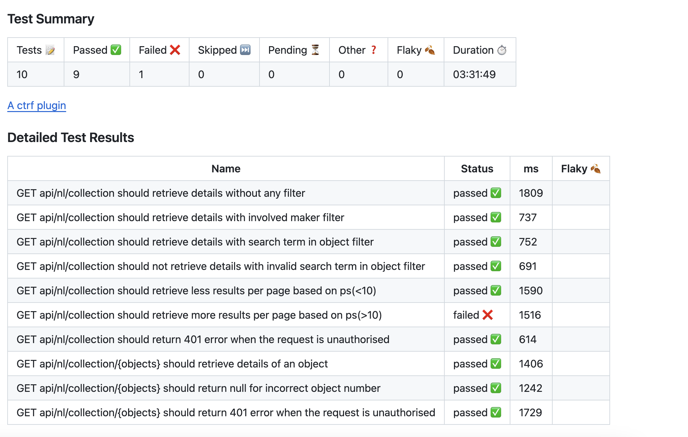

# Automated API Testing

Automated API Tests for Rijks Museum API was implemented as part of this project. The documentation for the API is available [here](https://data.rijksmuseum.nl/object-metadata/api/). This test framework was developed with SuperTest, Jest and Javascript.

## Frameworks
Following frameworks were used to implement the test tests
- [SuperTest](https://github.com/visionmedia/supertest) provides a high level absctraction for the HTTP requests
- [Jest](https://jestjs.io/) is a javascript testing framework
- [CTRF Json Reporter](https://github.com/ctrf-io/jest-ctrf-json-reporter) saves jest test results in json
- [Github Actions CTRF](https://github.com/ctrf-io/jest-ctrf-json-reporter) displays test result report on Github Actions

## Github Actions
The tests are also executed as part of Continuous Integration using Github Actions.

The configuration file for the same is available here `.github/workflows/ci.yml`

A github actions report is added which provides a dashboard for test results.

## Test Scenarios

#### Following test scenarios were covered
 - Retrieve details of Collections with no filters
 - Retrieve details of Collections with Involved maker filter
 - Retrieve details of Collections with Search Term filter
 - Retrieve different number of results per page for Collections
 - Retrieve details of Object
 - Unauthorised access to API

One bug was identified. When the parameter `ps` which determines the number of result entries per page is greater than `10`, still only `10` results are returned. This test case fails in the execution.

## Steps to execute

- #### Pre-requisite
    - `node.js` should be installed on the system.

- #### Setup
    - Run `npm install` to install node modules.

- #### Execute tests on Local
    -  To execute all the tests

        `TOKEN=${YOUR_TOKEN} npm run test` 

- #### Execute tests on Github actions
    - Fork the repository
    - For the forked respository, create an secret as per steps [here](https://docs.github.com/en/actions/security-guides/encrypted-secrets). Add personal token in the variable `TOKEN`
    - Now trigger the Gists API Test workflow from Github Actions.